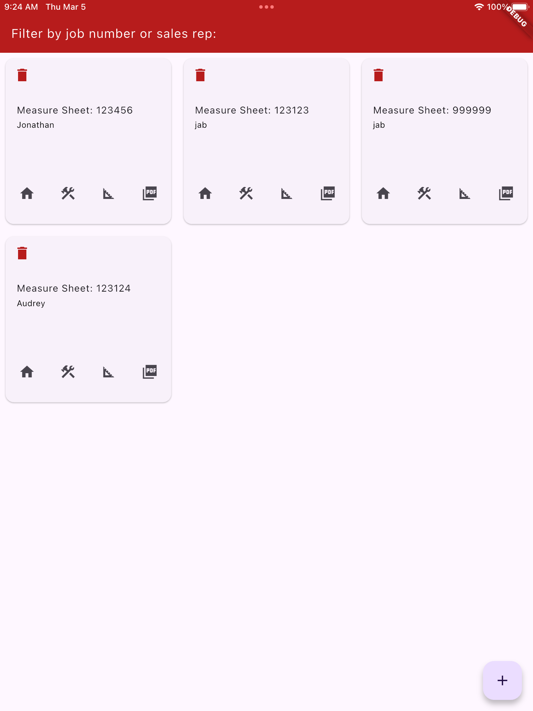
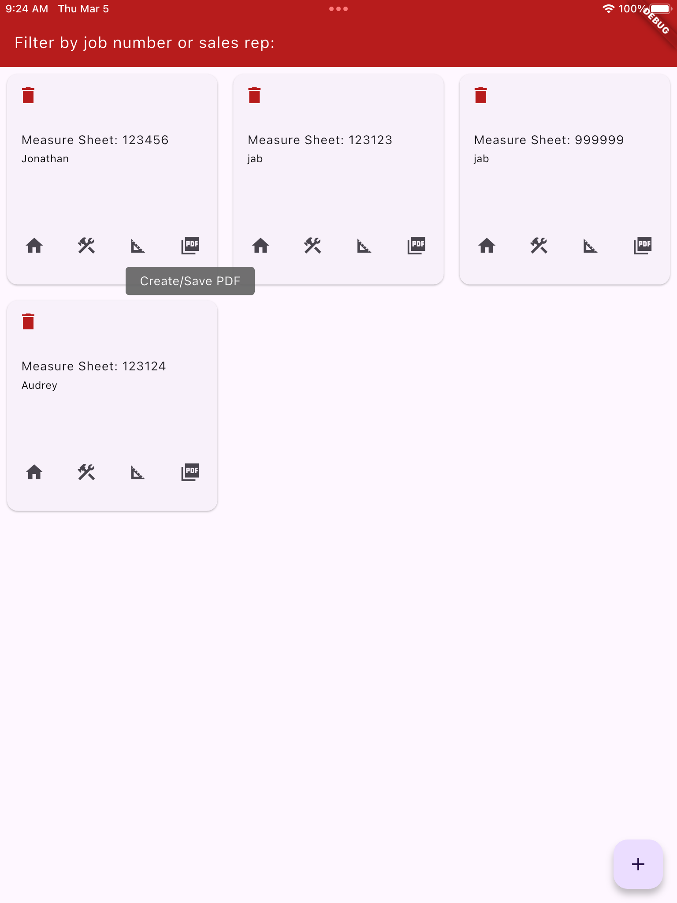
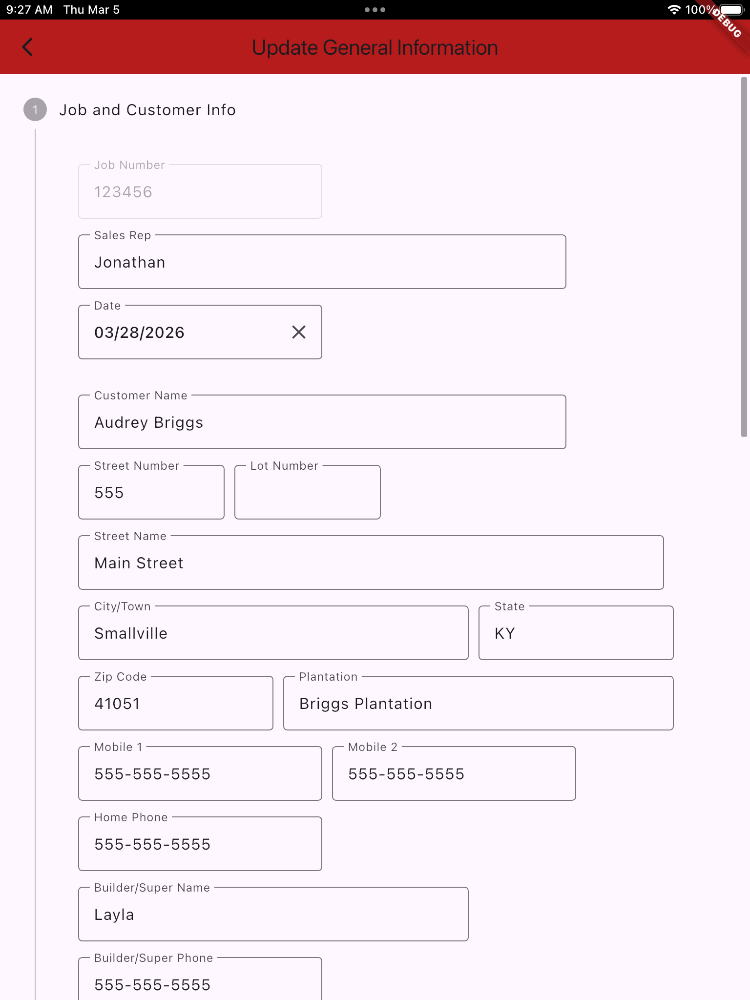
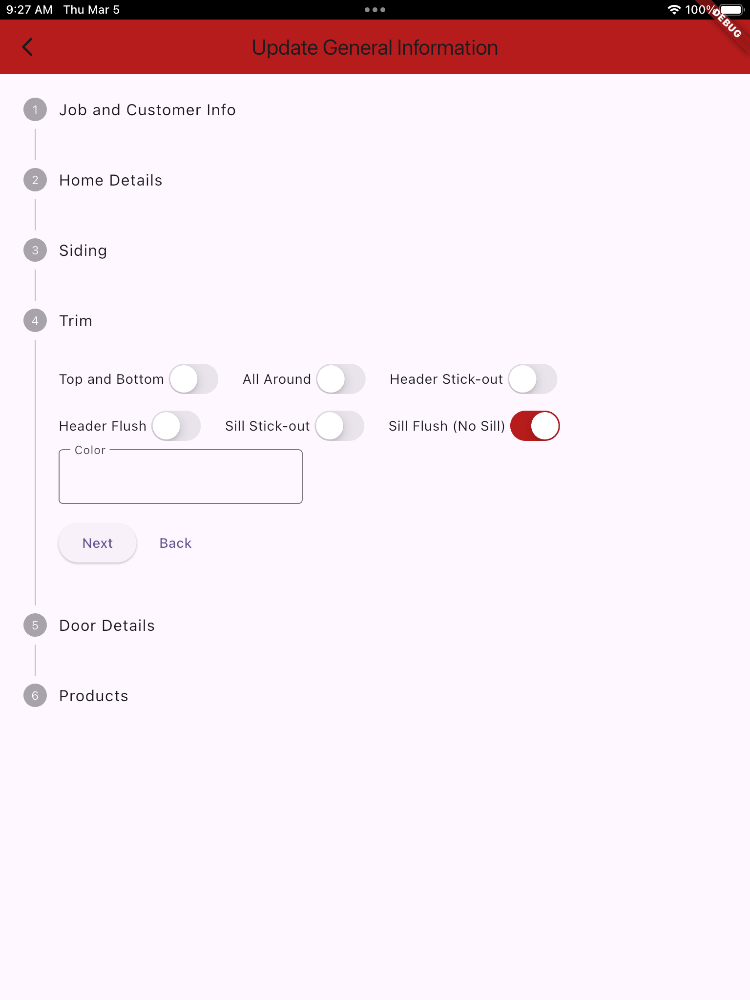
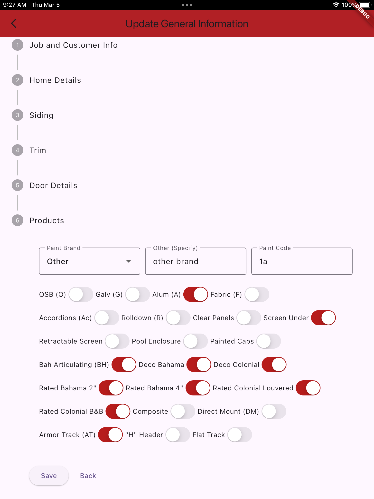
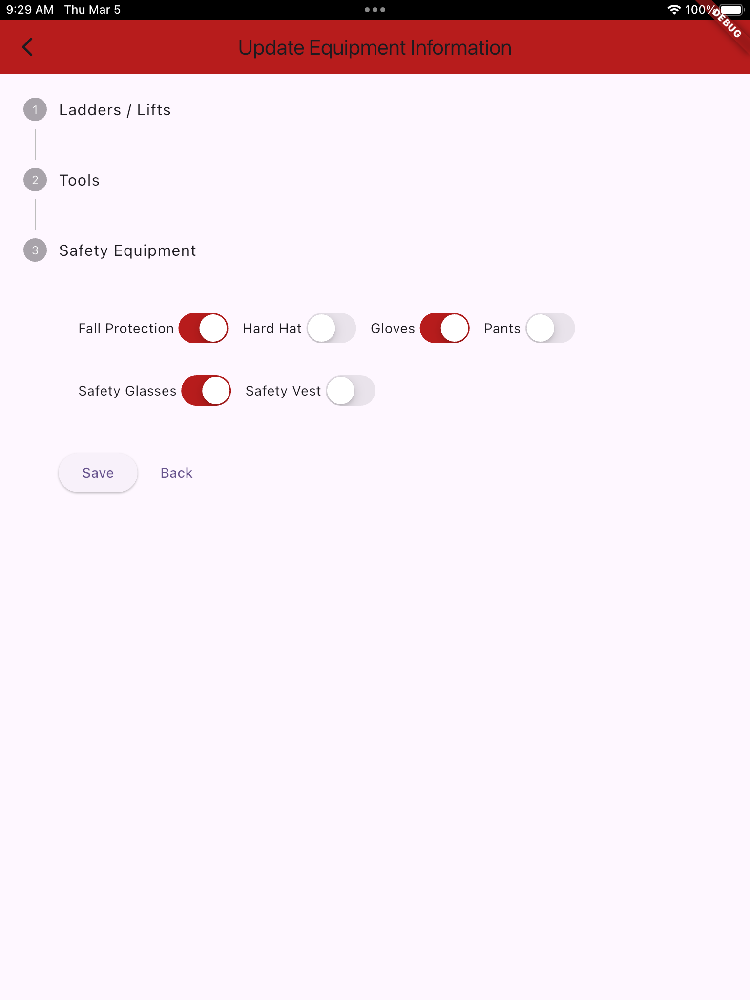
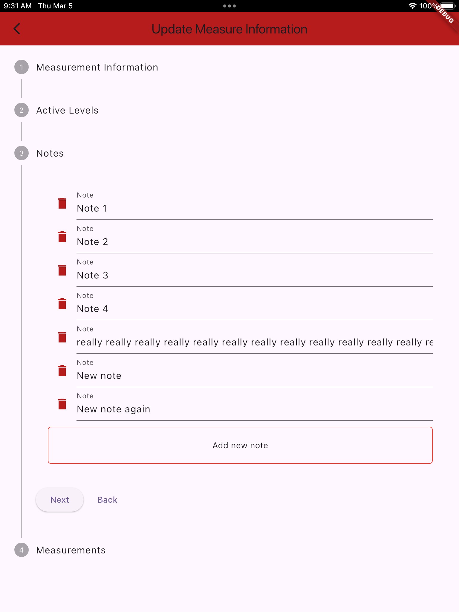
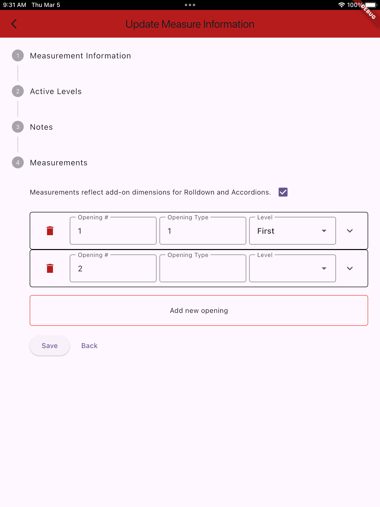
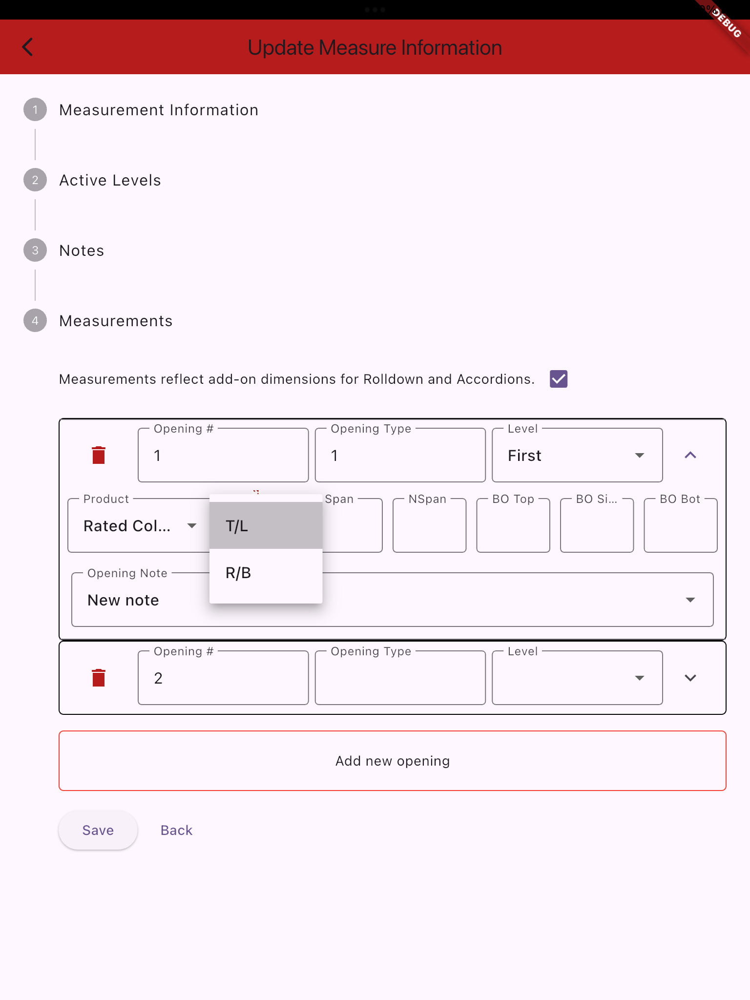

# armor_measure_sheet

Mobile application designed to allow the users to enter measure sheet 
job related data electronically and output a PDF artifact.

## Getting Started

### Development

If you're developing here, I'm expecting you to be able to handle 
installing the necessary dependencies without 
me holding your hand.

Right now there are no external dependencies, but you will absolutely need:
- Dart
- Flutter
- Android Studio (Emulator)
- XCode (Simulator)
- Apple Developer Account (Local Device Development)

I will change this section once data is centralized and devices point to that.

### Users

The idea is efficient input of data and automated creation of PDF
artifacts for jobs.

#### Examples

Here are screenshots of the 0.0.1 build.  This probably won't be exactly what goes
live to production devices, but should give some ideas.

##### Main Dashboard

Screen allows for quick filtering on job number, or sales rep name.  
Displays each measure sheet as a card with options to Delete, General Information,
Equipment Information, Measurement Information, or Create/Save PDF.

Icons can be long-pressed to show their intentions.

##### Forms

Each form is broken into Steps.  Next to go to next Step.  Back to previous Step.  
On the final step there is no Next, the option
changes to Save.

** This is not inclusive of all possible screenshots, just examples.

###### General Information Form

###### Equipment Information Form

###### Measurement Information Form

